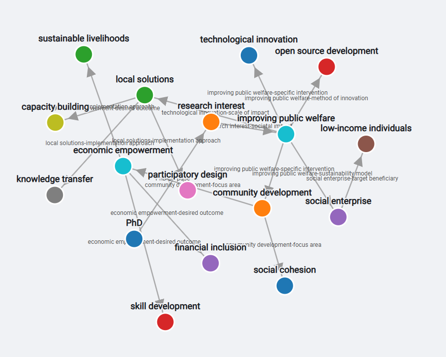

# AI Explorer



This is a full-stack, interactive web application for visually expanding upon the relationships associated with a given query. Users begin with a text query, expand the graph based on AI-driven suggestions, and use the inspiration of the results to generate a final, context-aware answer from the Gemini AI.

The project is a monorepo containing:
* **Backend (Node.js / Express):** A server that securely manages the Google AI API using natural language prompts and serves data to the client.
* **Frontend (HTML / CSS / JS):** A static client-side application that handles all D3.js visualization, user interaction, and state management.

---

## Features

### Frontend (Client)
* **Interactive Graph:** Generates a simulated graph from a simple text query using D3.js.
* **Relation-Based Expansion:** Click any node to get AI-powered suggestions for related terms and relationships.
* **Selection Mode:** Interactively choose which suggested nodes to include, or request more suggetions.

### Backend (Server)
* **Intelligent Prompt Engineering:** Uses a sophisticated set of prompts from `api/prompts.js` to instruct the AI to act as different "expert" personas.
* **Multi-Model Strategy:** Uses different Gemini models for different jobs:
    * **`gemini-2.5-flash-lite`:** For fast, low-cost graph operations (terms, suggestions).
    * **`gemini-2.5-flash`:** For high-quality, final answer generation.

---

## Architecture

This project is built with a clean separation of concerns.

### Backend Architecture (`/api`)

* **`api/routes.js` (API Router):** Defines all application endpoints (e.g., `/generate-graph`) and maps them to the controller.
* **`api/controller.js` (Logic Controller):** Orhcestrates request validation, prompt management, and AI service integration. It also formats the final response.
* **`api/aiService.js` (AI Service Layer):** An abstraction layer that handles all communication with the Google GenAI API.
* **`api/prompts.js` (Prompt Library):** Contains all the detailed, "few-shot" prompts that instruct the AI on its task, persona, and output format (JSON).

### Frontend Architecture (`/public`)

* **`graphView.js` (View Layer):** "Dumb" D3.js component that only knows how to render the state it's given. Uses D3's `.join()` pattern for animated transitions.
* **`uiController.js` (Logic/Controller Layer):** Handles all user events (clicks, keys), coordinates with the backend API, and contains the logic for **how to perform, undo, and redo** every action.
* **`appState.js` (State Service):** A centralized service that encapsulates all application state. It provides controlled data access through a well-defined API and manages the action history to enable undo/redo functionality.
* **`apiService.js` (Client API Service):** Isolates communication from the frontend to the backend server.

---

## API Endpoints (Served by this Server)

All endpoints are prefixed by the server URL (e.g., `http://localhost:3000`).

* **`POST /generate-graph`**: Generates the initial graph from a query.
* **`POST /suggest-relationship`**: Gets AI-powered suggestions for an existing node.
* **`POST /suggest-alternatives`**: Gets new suggestions if the user dismissed the previous ones.
* **`POST /response`**: Generates the final, text-based answer from the curated graph.

---

## Setup and Installation

This project requires Node.js and a Google AI API Key.

1.  **Clone the repository:**
    ```sh
    git clone https://github.com/iphswift/ai-explorer.git
    cd ai-explorer
    ```

2.  **Install Dependencies:**
    Install the Node.js packages for the server and a live-server for the client.
    ```sh
    # Install backend dependencies (Express, CORS, etc.)
    npm install

    # Install live-server for the frontend (if not already installed globally)
    npm install -g live-server
    ```

3.  **Create an Environment File:**
    Create a file named `.env` in the **root** of the project. This is critical for storing your API key securely.

4.  **Add Environment Variables:**
    Open the `.env` file and add your Google API key and a port number:
    ```
    # Get your API key from Google AI Studio
    GOOGLE_API_KEY=your_google_api_key_here

    # The port the API server will run on
    PORT=3000
    ```
    **⚠️ Warning: API calls will incur costs\!** Please review Google's pricing before proceeding.

5.  **Run the Backend Server:**
    Start the backend API server from the project root.
    ```sh
    npm start
    ```
    (This assumes your `package.json` has a `start` script like `"start": "node index.js"`). The API will be available at `http://localhost:3000`.

6.  **Run the Frontend Application:**
    In a separate terminal,  start `live-server`.
    ```sh
    live-server
    ```
    `live-server` will automatically open your browser to the correct address (usually `http://127.0.0.1:8080`).

---

## File Structure

```
.
├── /api/ # Backend logic
│ ├── aiService.js # Google AI API connection
│ ├── controller.js # Express request handlers
│ ├── prompts.js # All AI prompts
│ └── routes.js # API route definitions
├── /public/ # Frontend (client) code
│ ├── apiService.js # Frontend fetch logic
│ ├── appState.js # State service (action bus)
│ ├── graphView.js # D3.js rendering
│ ├── main.js # Frontend entry point
│ ├── parser.worker.js # Markdown parser
│ ├── style.css # All styles
│ └── uiController.js # Frontend event logic
├── .env # Securely stores API keys (DO NOT COMMIT)
├── index.js # Backend server entry point (Express)
├── index.html # Main HTML page 
├── package.json
└── README.md # This file
```